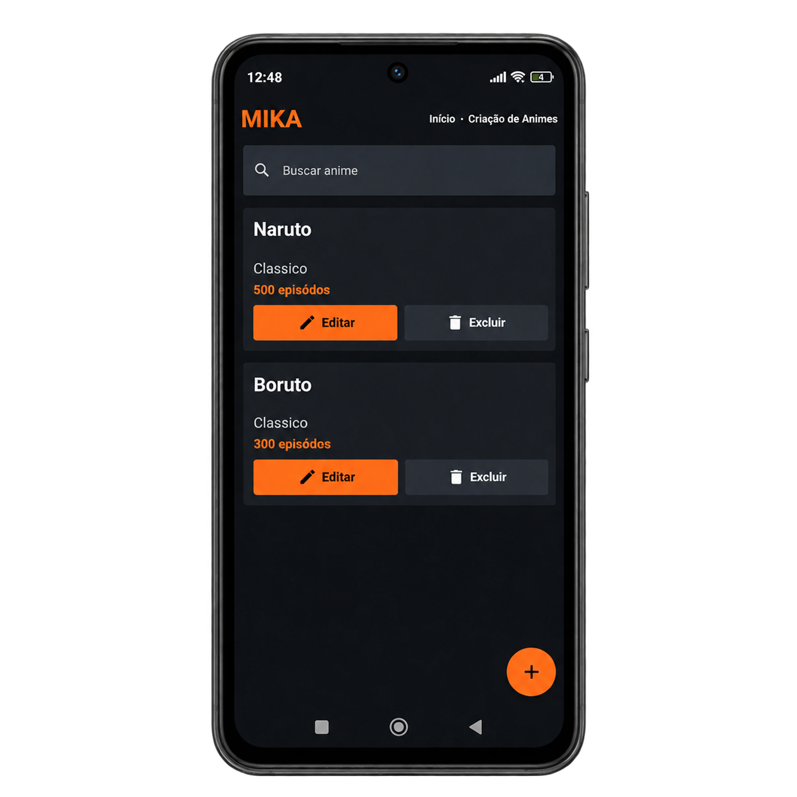

# CRUD de Animes

Projeto desenvolvido com React Native e Expo.

## O que precisa estar instalado

Antes de executar o projeto, instale:

- **Node.js**: recomendado na versao LTS. Ele executa o JavaScript e permite usar o npm.
- **npm**: vem instalado junto com o Node.js e instala as dependencias do projeto.
- **Expo Go**: aplicativo para abrir o projeto em um celular Android ou iPhone.
- **Git**: opcional, somente se voce for clonar o repositorio pelo terminal.
- **VS Code**: opcional, recomendado para editar o codigo.

Para usar um emulador Android, instale tambem o Android Studio. Para usar um simulador iOS, e necessario um Mac com Xcode.

Verifique Node.js e npm com:

```bash
node --version
npm --version
```

Este projeto usa o Expo instalado pelo proprio projeto. Nao e necessario instalar o antigo `expo-cli` globalmente.

## Resultado



## Como baixar o projeto

1. Baixe ou clone este repositorio.
2. Abra a pasta `MeuAppCRUD` no VS Code.
3. Abra o terminal nessa pasta.

Se estiver usando Git:

```bash
git clone https://github.com/camilyolivei/MeuAppCRUD.git
cd MeuAppCRUD
```

## Como instalar

Entre na pasta do projeto e instale as dependencias:

```bash
npm install
```

## Como executar

Inicie o servidor de desenvolvimento do Expo:

```bash
npx expo start
```

O comando abre o painel do Expo no terminal e, normalmente, uma pagina no navegador. No terminal, escolha uma opcao:

- Pressione `w` para abrir no navegador.
- Pressione `a` para abrir no Android.
- Leia o QR Code com o aplicativo Expo Go no celular.

Tambem e possivel executar diretamente no navegador:

```bash
npm run web
```

## Como usar o QR Code

1. Instale o aplicativo **Expo Go** no celular.
2. Execute `npx expo start` dentro da pasta `MeuAppCRUD`.
3. Deixe o computador e o celular conectados a mesma rede Wi-Fi.
4. Abra o Expo Go e escaneie o QR Code exibido no terminal ou no painel do Expo.
5. O Expo Go carrega o aplicativo diretamente do servidor que esta rodando no computador.

O QR Code nao e o aplicativo pronto para download. Ele apenas contem o endereco do servidor de desenvolvimento. Por isso, o computador precisa continuar ligado e com o Expo executando.

Se o QR Code nao funcionar na rede local, use o modo tunnel:

```bash
npx expo start --tunnel
```

O modo tunnel pode funcionar mesmo quando o celular e o computador nao conseguem se comunicar diretamente pela mesma rede, mas pode ser mais lento.

## Funcionalidades

- Cadastro de animes.
- Edicao de animes.
- Exclusao com confirmacao.
- Busca por titulo ou resumo.
- Validacao de campos obrigatorios.
- Bloqueio de titulos duplicados.

## Arquitetura

O projeto usa MVVM com responsabilidades separadas:

- `src/view/`: telas e componentes de interface.
- `src/viewmodel/`: estado e regras de interacao da tela.
- `src/service/`: regras de negocio.
- `src/repository/`: armazenamento dos dados.
- `src/entity/`: tipos e entidades do dominio.
- `src/style/`: estilos da aplicacao.

## Estrutura principal

- `App.tsx`: ponto de entrada da aplicacao.
- `src/view/ListaView.tsx`: tela principal da lista de animes.
- `src/components/`: componentes visuais reutilizaveis.
- `src/entity/Anime.ts`: tipos `Anime` e `NovoAnime`.
- `src/repository/AnimeRepositorio.ts`: operacoes de dados.
- `src/service/AnimeServico.ts`: regras de negocio.
- `src/viewmodel/AnimeViewModel.ts`: custom hook com estado e fluxo da tela.
- `assets/images/`: imagens adicionadas ao projeto, incluindo a imagem de resultado.
- `assets/images/resultado.png`: imagem de teste exibida neste README.
- `package.json`: dependencias e comandos do projeto.
